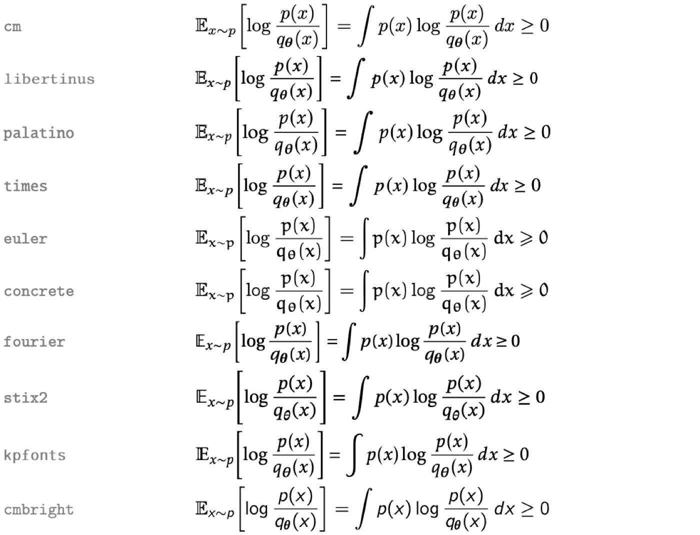

<p align="center"></p>

# LaTeX for Claude Code

A Claude Code mod that renders TeX maths, TikZ diagrams and LaTeX blocks in the Code tab of the Claude desktop app. Formulas can be typeset in any of 10 LaTeX fonts by your own TeX install.

This is a community plugin. It is not made or endorsed by Anthropic.

Without it, Claude's replies show maths as raw source, such as `$\frac{\partial L}{\partial \phi}$`. With it, the same reply shows typeset maths.

## What it renders

| You write | You see |
| --- | --- |
| `$...$` or `\(...\)` | Inline maths, aligned with the surrounding text |
| `$$...$$`, `\[...\]`, `equation`, `align`, `gather`, `multline` | Centred display maths with a **Copy TeX** button |
| A ` ```tikz ` or ` ```tikzcd ` code block | A diagram compiled by your own TeX install |
| A ` ```latex ` code block | Any LaTeX snippet compiled by your own TeX install: chemfig, quantikz, bussproofs, algorithmic, tables |

It also works on maths in the messages you send.

MathJax handles AMS environments, `mathtools`, `\ce{}` chemistry (mhchem), `\dv` and `\qty` (physics), `\bra`/`\ket` (braket), `\cancel` and `\color`. `\bm` works as `\boldsymbol`.

Dollar amounts are left alone. `$5 and $10` stays as text, because a closing `$` followed by a digit, or an opening `$` followed by a space, does not start maths. Maths inside code blocks and inline code is left as code. A formula MathJax cannot parse is shown as red TeX source.

## Install

You need Claude Code 2.1.287 or later, which is the first release with mods.

```sh
claude plugin marketplace add zaahiral/claude-latex
claude plugin install latex@claude-latex
```

Restart the desktop app, or run `/reload-plugins` in an open session.

## Settings

Change these in `/config` or in the plugin's settings in `/plugin`.

| Setting | Default | What it does |
| --- | --- | --- |
| Maths font | `mathjax` | `mathjax` draws instantly in Computer Modern. Any other choice typesets every formula with your local LaTeX in that font. |
| Maths colour | `auto` | `auto` follows your system's light or dark setting. Pick `light` or `dark` if the app's theme differs from your system's. |
| Compile LaTeX blocks | on | Compile ` ```tikz `, ` ```tikzcd ` and ` ```latex ` blocks with `latex` and `dvisvgm`. |
| Render maths in your messages | on | Also render maths in the messages you send. |
| Macros file | `~/.claude/latex-macros.tex` | Definitions applied to every formula. |

### Fonts



Set **Maths font** to `cm`, `libertinus`, `palatino`, `times`, `euler`, `concrete`, `fourier`, `stix2`, `kpfonts` or `cmbright`. Each formula first appears in MathJax, then the LaTeX version replaces it, usually within a second. All formulas in a message are typeset in one LaTeX run and cached in `~/.cache/claude-latex/`. A formula LaTeX rejects stays in MathJax. Diagrams and LaTeX blocks use the same font.

This needs `latex` and `dvisvgm`. TeX Live and MacTeX include the fonts above.

### Macros

Put `\newcommand` and `\DeclareMathOperator` lines in `~/.claude/latex-macros.tex`:

```tex
\newcommand{\E}{\mathbb{E}}
\newcommand{\R}{\mathbb{R}}
\DeclareMathOperator*{\argmin}{arg\,min}
```

Then `$\E[X]$` and `$\argmin_\theta L(\theta)$` work in every message, in MathJax and in LaTeX. An error in the file is printed once in the transcript when a session starts.

### TikZ and LaTeX blocks

These need a TeX install that has `latex` and `dvisvgm`, such as TeX Live or MacTeX. The mod looks in `/Library/TeX/texbin`, `/opt/homebrew/bin`, `/usr/local/bin`, `/usr/bin` and your `PATH`. Without one, TikZ blocks stay as code.

A ` ```tikz ` block holds the inside of a `tikzpicture`. A ` ```tikzcd ` block holds the inside of a `tikzcd`. A ` ```latex ` block holds a document body up to 15 cm wide. Lines at the top of any block that start with `\usepackage`, `\usetikzlibrary`, `\pgfplotsset`, `\tikzset`, `\newcommand` or `\DeclareMathOperator` go into the preamble.

````md
```tikzcd
A \arrow[r, "f"] \arrow[d, "g"'] & B \arrow[d, "h"] \\
C \arrow[r, "k"'] & D
```
````

````md
```latex
\usepackage{chemfig}
\chemfig{*6((-OH)=-=(-COOH)-=-)}
```
````

Every block loads `amsmath`, `bm`, `mathtools`, `xcolor`, `cancel`, `braket` and `mhchem`. TikZ blocks also load `tikz-cd`, `pgfplots` and the TikZ libraries `arrows.meta`, `positioning`, `calc`, `shapes.geometric`, `shapes.misc`, `decorations.pathreplacing`, `matrix`, `fit` and `backgrounds`.

A diagram compiles in about a second the first time. Compiled diagrams are cached in `~/.cache/claude-latex/`. Black lines and text follow the theme. Other colours stay as written.

LaTeX runs with `-no-shell-escape`, so a diagram cannot run shell commands. A diagram can still read files your user can read through `\input`, the same as any LaTeX document you compile.

## Where it works

| Where | Renders |
| --- | --- |
| Code tab of the Claude desktop app | Yes |
| Claude mobile app through Remote Control | Should work, not tested |
| `claude` in a terminal | No. Terminals cannot draw SVG. Maths shows as source. |
| VS Code extension, `claude -p` | No. Mods do not draw there. |

## How it works

A mod is a plugin whose code runs inside Claude Code. This one hooks the drawing of each message (`ui.render` on `AssistantMessage` and `UserMessage`). When a message contains maths, it splits the text into pieces:

- Paragraphs without maths go back to the app's own Markdown renderer.
- Display maths becomes an SVG from [MathJax 3](https://www.mathjax.org/), bundled in `hooks/mathjax/`.
- A paragraph with inline maths is laid out word by word. Each formula is an SVG padded so its baseline lines up with the text.
- TikZ blocks are queued. A timer compiles them with `latex` and `dvisvgm` and asks for a redraw.

MathJax runs inside the mod, with no browser page and no network access. The bundle is split into chunks because a mod cannot import a file over 1 MiB. `build/build.sh` rebuilds it from `mathjax-full` 3.2.2, so you can check the minified files match the published source.

Before installing, you can list everything the mod hooks and calls:

```sh
claude plugin validate .
```

## Known limits

- Inline maths is centred on the text's middle line, so a tall formula such as a fraction can sit slightly high or low next to the words.
- A paragraph with inline maths loses Markdown links and nested formatting. Bold, italic and inline code are kept.
- Tables keep the app's own rendering, so maths inside a table cell stays as source.
- MathJax packages included: base, ams, newcommand, mhchem, physics, boldsymbol, cancel, color, braket, textmacros, mathtools.
- MathJax has one font. The other fonts need a local TeX install.

## Develop

```sh
git clone https://github.com/zaahiral/claude-latex
claude --plugin-dir ./claude-latex
claude plugin test ./claude-latex
```

## Licence

MIT. MathJax is Apache 2.0, and its licence is in `hooks/mathjax/LICENSE`. Clawd is Anthropic's Claude Code mascot. The logo is drawn in TikZ in `assets/logo.tex`.
