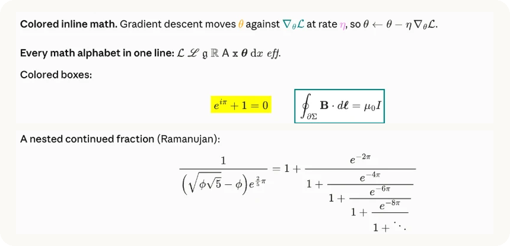
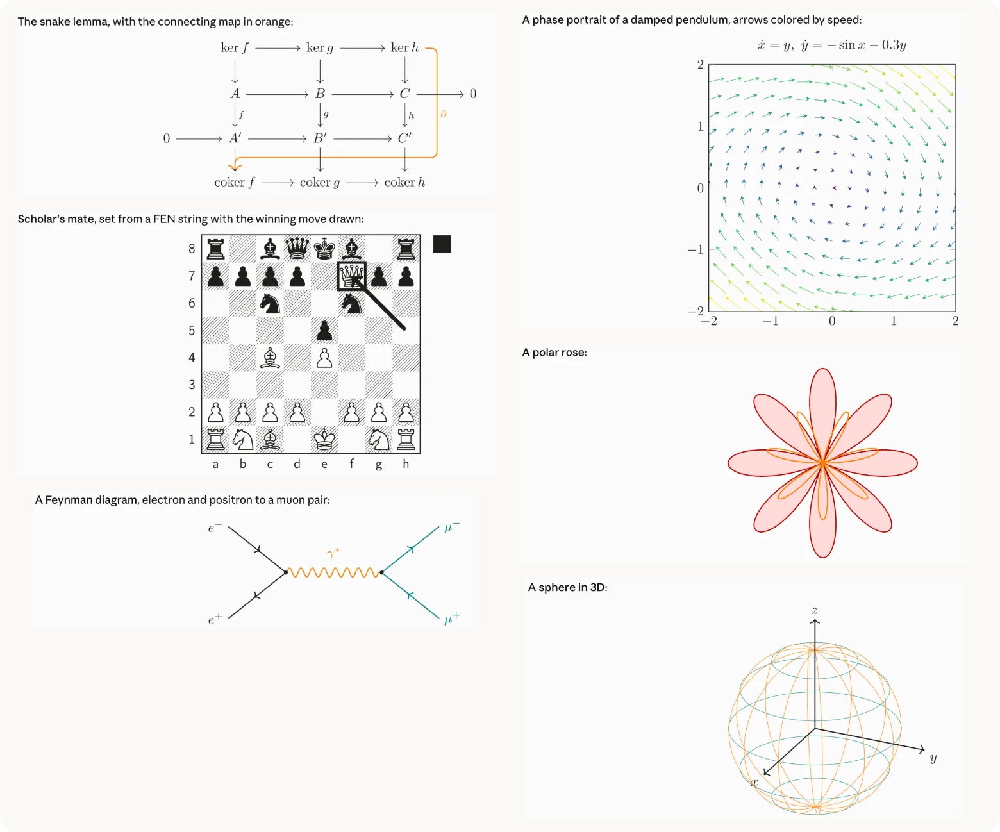

<p align="center">
  
</p>

<h1 align="center">LaTeX for Claude Code</h1>

<p align="center">
  Renders TeX math, TikZ diagrams and LaTeX blocks in Claude's replies, in the Claude Code desktop app.
</p>

<p align="center">
  
  
  
</p>

Without this mod, Claude's replies show math as raw source, such as `$\frac{\partial L}{\partial w}$` (or Claude will default to try and use Unicode for math characters). With it, the same reply shows typeset math. With a TeX install, it also compiles diagrams, circuits, chess positions and whole LaTeX snippets right in the chat.

<p align="center">
  
</p>

## Install

```sh
claude plugin marketplace add zaahiral/claude-latex
claude plugin install latex@claude-latex
```

Then restart the desktop app, or run `/reload-plugins` in an open session. A short welcome note appears above the prompt the first time. Run `/latex` at any time to open the settings.

Requirements:

- **Claude Code 2.1.287 or later** (mods were introduced here).
- **The Code tab of the Claude desktop app.** Note that this mod cannot draw in the terminal/ for VS Code Extension. See [Where it works](#where-it-works). The chat section of the Claude desktop app already supports LaTeX rendering.
- **Optional: a TeX install** with `latex` and `dvisvgm`, such as [MacTeX](https://www.tug.org/mactex/) or TeX Live. You need it for diagrams, LaTeX blocks and the extra fonts. Math works without it.

## Rendering Capabilities

| Usage | Render |
| --- | --- |
| `$...$` or `\(...\)` | Inline math, uses texts baseline |
| `$$...$$`, `\[...\]`, `equation`, `align`, `gather`, `multline` | Centered display math |
| A ` ```tikz ` or ` ```tikzcd ` code block | A diagram (compiled by your TeX install) |
| A ` ```latex ` code block | Any LaTeX snippet: chemfig, quantikz, circuitikz, forest, chessboard, amsthm, tables |

<p align="center">
  
</p>

The two example images above are screenshots of the mod running in the Code tab.

MathJax draws the math, so AMS packages are preinstalled. 

### Your own messages

Experimental feature (WIP)! 

The goal is that we would allow the user's message, once sent, to render in chat with markdown/ LaTeX, similar to AI Studio. There's a hacky way of doing this, which is opt in but is not perfect.  You can access this feature using `\latex`. 

## Fonts

<p align="center">
  
</p>

The default and only MathJax font is Computer Modern. If you use this, rendering speeds will be a lot faster (almost instant).

However, you can set **Math font** to one of `cm`, `libertinus`, `palatino`, `times`, `euler`, `concrete`, `fourier`, `stix2`, `kpfonts` or `cmbright`, and your own LaTeX typesets every formula in that font. Since this takes longer to render, MathJax shows each formula (in Computer Modern) until the LaTeX version is ready, usually within a second. All formulas in a message compile in one run, and results are cached in `~/.cache/claude-latex/`. Diagrams and LaTeX blocks use the same font.

## Settings

Run `/latex` to open the settings pane. Each change applies at once.

| Setting | Default | Usage |
| --- | --- | --- |
| Math font | `mathjax` | MathJax, or one of 10 LaTeX fonts typeset by your TeX install |
| Math color | `auto` | `auto` follows your system's light or dark setting. Pick `light` or `dark` if the app's theme differs |
| Compile LaTeX blocks | on | Compile ` ```tikz `, ` ```tikzcd ` and ` ```latex ` blocks |
| Math under your messages | on | Show the math and diagrams from your messages under the bubble |
| Full rendered copy of your messages | off | Show your whole message rendered under the bubble |
| Copy TeX button | off | A button under each display formula and block that copies its source |
| Macros file | `~/.claude/latex-macros.tex` | Your own `\newcommand` and `\DeclareMathOperator` lines |

### Macros

Put definitions in `~/.claude/latex-macros.tex`:

```tex
\newcommand{\E}{\mathbb{E}}
\newcommand{\R}{\mathbb{R}}
\DeclareMathOperator*{\argmin}{arg\,min}
```

This here would mean `$\E[X]$` and `$\argmin_\theta L(\theta)$` then work in every message, in MathJax and in LaTeX.

### LaTeX blocks

A ` ```tikz ` block holds the inside of a `tikzpicture`. A ` ```tikzcd ` block holds the inside of a `tikzcd`. A ` ```latex ` block holds a document body up to 15 cm wide. Lines at the top of a block that start with `\usepackage`, `\usetikzlibrary`, `\pgfplotsset`, `\tikzset`, `\newcommand`, `\DeclareMathOperator`, `\DeclareMathAlphabet`, `\newtheorem`, `\definecolor` and similar go into the preamble.

````md
```latex
\usepackage{chemfig}
\chemfig{*6((-OH)=-=(-COOH)-=-)}
```
````

Every block loads `amsmath`, `bm`, `mathtools`, `xcolor`, `cancel`, `braket` and `mhchem`. TikZ blocks also load `tikz-cd`, `pgfplots` and the common TikZ libraries. Black ink follows your theme. Other colors stay as written.

## Speed

Diagrams can be a little slow i.e 0.4 to 0.7 seconds to compile the first time and instant after that. Currently upto three compiles run at once. Each kind of document compiles against a saved LaTeX format that already holds its preamble, which roughly halves LaTeX's time. 

## Security

Claude writes the LaTeX blocks, so a reply could try to make LaTeX read or write your files. The mod treats every block as untrusted:

- Shell escape is off (`-no-shell-escape`).
- Every `latex` and `dvisvgm` run goes through macOS's `sandbox-exec`. The sandbox blocks reading your home folder apart from TeX's own folders and the mod's cache, blocks writing anywhere else, and blocks the network.
- TeX's own `openout_any=p` blocks writing outside the build folder.
- A compile is stopped after 60 seconds.
- A drawing over the app's 128 KB limit shows an error on that block instead of breaking the message.

Details and how to report a problem are in [SECURITY.md](SECURITY.md).

## Where it works

| Where | Renders |
| --- | --- |
| Code tab of the Claude desktop app, macOS | Yes |
| Code tab on Windows | Math yes. LaTeX blocks are not supported yet |
| Claude mobile app through Remote Control | Should work, not tested |
| `claude` in a terminal | No. Terminals cannot draw SVG |
| VS Code extension, `claude -p` | No. Mods do not draw there |

## Troubleshooting

- **LaTeX blocks stay as code.** The mod did not find `latex` and `dvisvgm`. It looks in `/Library/TeX/texbin`, `/opt/homebrew/bin`, `/usr/local/bin`, `/usr/bin` and your `PATH`.
- **Something else looks wrong.** Each session writes a setup log to `~/.cache/claude-latex/debug/setup.log`, with every setup step, how long it took, and any drawing error. Attach it to a bug report.

## How it works

A mod is a plugin whose code runs inside Claude Code. This one hooks the drawing of each message (`ui.render` on `AssistantMessage` and `UserMessage`). When a message contains math, it splits the text into pieces. Prose goes back to the app's own Markdown renderer. Display math becomes an SVG from [MathJax 3](https://www.mathjax.org/), which runs inside the mod with no network access. A paragraph with inline math is laid out word by word, with each formula padded so its baseline lines up with the text. LaTeX blocks are queued, compiled in the background with `latex` and `dvisvgm`, and drawn when ready.

The MathJax bundle is in `hooks/mathjax/`, split into chunks because a mod cannot import a file over 1 MiB. `build/build.sh` rebuilds it from `mathjax-full` 3.2.2, so you can check it against the published source.

To list everything the mod hooks and calls before you install it:

```sh
claude plugin validate .
```

## Known limits

- A very long inline formula is scaled down to fit the line. (Looking to add scrolling for long formula, WIP)
- Tables keep Claude Code's own rendering, so math inside a table cell stays as source. 
- A paragraph with inline math loses Markdown links. Bold, italic and inline code are kept.
- Markdown in your own message cannot render inside the app's bubble. Turn on the full rendered copy to see it under the bubble. (Also WIP). 

## Develop

```sh
git clone https://github.com/zaahiral/claude-latex
claude --plugin-dir ./claude-latex
claude plugin test ./claude-latex
```

The tests need Claude Code 2.1.286 or later. They fake `latex` and `dvisvgm`, so they run without a TeX install.

## License

MIT. MathJax is Apache 2.0, and its license is in `hooks/mathjax/LICENSE`.

This is a community plugin.
